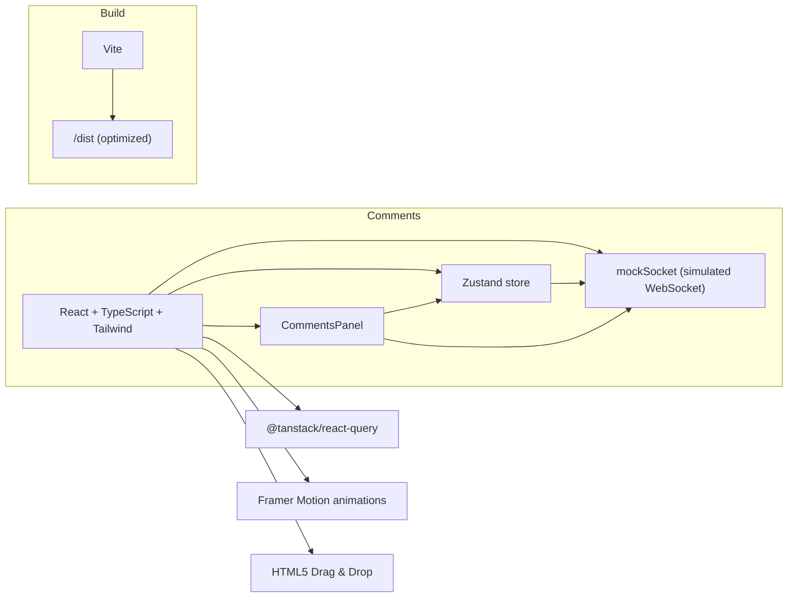

# Architecture Overview

Summary:
- Frontend: React + TypeScript, styles via Tailwind.
- State: Zustand for UI state, board, presence; React Query for async data patterns.
- Real-time: `src/lib/mockSocket.ts` simulates incoming comments and confirmations.
- Animations: Framer Motion used for layout and motion effects.
- Build: Vite with production optimizations and GitHub Actions workflow deploying to GitHub Pages.
